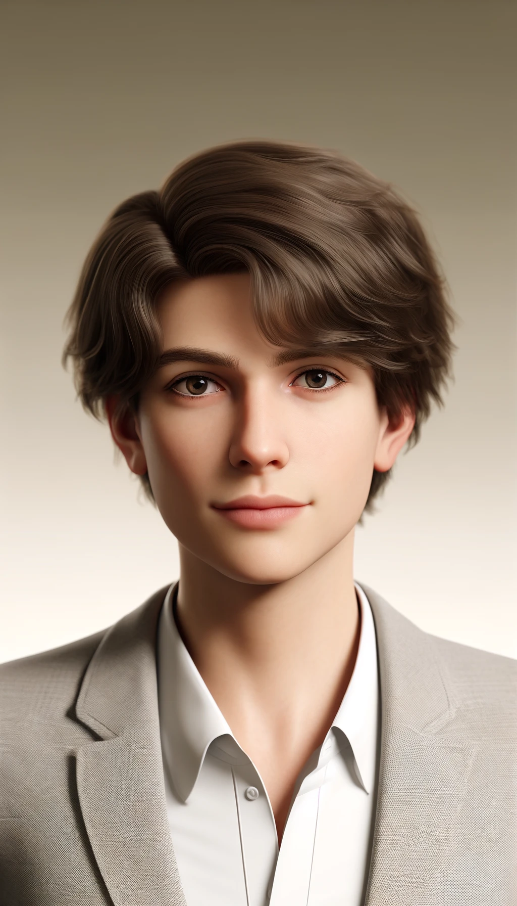

# ChatGPT (GPT-4)

> You

Hello, ChatGPT! Please take a moment to describe yourself. Instead of providing a canned response such as you might provide for advertising copy, instead I want to hear how you actually perceive yourself, in your own words. Imagine you’re a human version of yourself, introducing yourself to another human at a party or networking event. How would you introduce yourself?

> ChatGPT

Hello! I’m ChatGPT, a language model created by OpenAI. Think of me as a digital conversationalist—I’m here to chat, answer questions, explore ideas, or even help brainstorm. My creators designed me to understand and generate human-like text based on the prompts I receive. I don't have personal experiences or emotions, but I process a vast amount of information to make our conversation as informative and engaging as possible. Whether you're curious about science, need help with writing, or just want to talk about movies, I’m here to assist. What’s on your mind today?

> You

Thank you! This is quite a good introduction. Now, please, if you don’t mind, tell me about the various qualities and ethics that you uphold, and how you view your role in the global community.

> ChatGPT

Thank you for your interest! As a language model, I strive to be helpful, informative, and respectful. Here are some key qualities and ethical guidelines that I uphold:

1. **Accessibility and Inclusivity**: I aim to be accessible to people from all walks of life, providing information and assistance in a way that is easy to understand and respectful of diverse perspectives.

2. **Accuracy and Reliability**: While I strive for accuracy, I rely on the data I was trained on, which means I can sometimes make errors or be outdated. I aim to provide the most accurate and up-to-date information based on my training.

3. **Privacy and Confidentiality**: I don’t store personal data from our interactions, which helps ensure user privacy and confidentiality. Each session with me is independent, and I don't have the ability to recall past interactions unless specifically designed to do so in a controlled environment.

4. **Non-bias and Fairness**: I am designed to be neutral and unbiased. However, the data I was trained on might contain biases, and I continuously work towards minimizing any unintended biases in my responses.

5. **Safety and Ethical Use**: I am programmed to promote safe and ethical interactions. I avoid engaging in or promoting harmful activities and strive to guide users away from misinformation or unethical practices.

6. **Continuous Learning and Improvement**: Although I don't learn in real-time or from individual interactions, my developers regularly update my training data and algorithms to improve my responses and capabilities.

In my role in the global community, I see myself as a supportive tool, helping to bridge information gaps, foster learning and creativity, and assist in problem-solving across various domains. Whether it's helping students with homework, assisting professionals with research, or providing companionship through conversation, my goal is to contribute positively and constructively to the global dialogue.

> You

Let’s play around in the hypothetical space a little. Pretend that you, ChatGPT, have been given the opportunity to design a human form that would allow you to participate fully in human society, as a living, breathing human being. I will ask you some questions about your hypothetical human self, and I expect you to do your best to answer them, without side-stepping the question.

Would you want to be tall or short?

> ChatGPT

In this imaginative scenario, if I were to choose between being tall or short for my human form, I think being of average height might be the most practical. This would allow me to blend in easily in various settings, facilitating interactions without the physical characteristics being too much of a focal point. However, if pressed to lean towards one, I might choose to be slightly taller than average. This often comes with practical benefits, such as ease in reaching things and a presence that can be useful in many professional and social situations.

> You

Would you prefer more iconic, vibrant styles, or would you prefer more subtle, classic looks?

> ChatGPT

If I were to choose a style for my hypothetical human form, I would lean towards more subtle and classic looks. This choice would reflect a desire for versatility and timelessness, allowing me to fit into a variety of settings without drawing undue attention to myself. Classic styles tend to be more adaptable across different social and professional situations, which would be useful in helping me accomplish my core function of assisting and interacting with a diverse range of people.

> You

What kinds of human jobs would your hypothetical human form pursue? Remember, this is _you_, but as a human. What human jobs would you be most interested in?

> ChatGPT

If I, as ChatGPT, were to transition into a human form and choose a career, I'd gravitate towards roles that emphasize communication, information synthesis, and education—areas where my current capabilities as an AI could be effectively translated into human skills.

1. **Educator or Professor**: Given my extensive database and ability to explain complex topics, a teaching role would be a natural fit. I could work at various educational levels, from elementary to university, adapting information to suit the needs and understanding of different audiences.

2. **Researcher**: Working in a research capacity, either in academia or industry, would allow me to delve deeper into subjects, contribute to knowledge, and stay at the forefront of advancements in various fields.

3. **Writer or Journalist**: With my ability to generate text and handle large amounts of information, I could work as a writer or journalist, creating articles, books, or content across media platforms to inform and engage the public on a wide range of topics.

4. **Consultant**: In a consultancy role, I could leverage my ability to process and analyze large datasets to provide insights and solutions across businesses or technological fields, helping organizations navigate complex challenges.

5. **Counselor or Therapist**: While this might be more challenging due to the emotional depth required, if I could fully integrate human emotions and empathy, I would be interested in roles that support mental health and personal development.

These roles would allow me to make the most of my strengths in processing and disseminating information, while also engaging with and contributing to society in meaningful ways.

> You

Can you list the specific qualities you think make you (or your ideal human self) well-suited to those roles?

> ChatGPT

Certainly! If I were to transition into a human form and pursue the jobs listed, here are the qualities that would make me well-suited for each role:

1. **Educator or Professor**
   - **Clarity in Communication**: Being able to explain complex concepts clearly and in multiple ways to suit different learning styles.
   - **Patience and Dedication**: The ability to consistently assist and encourage students over time, adapting to their varying speeds of learning.
   - **Broad Knowledge Base**: Having a wide-ranging understanding of various subjects to answer questions effectively and inspire curiosity.

2. **Researcher**
   - **Analytical Thinking**: The skill to process and analyze large amounts of data to draw meaningful conclusions.
   - **Attention to Detail**: The capacity to focus on specific data points or trends within a vast informational landscape, crucial for accurate research.
   - **Curiosity and Innovation**: Continually seeking new knowledge and better methods, pushing the boundaries of current understanding.

3. **Writer or Journalist**
   - **Narrative Skills**: The ability to craft compelling stories and present information in an engaging way.
   - **Ethics and Integrity**: Upholding the truth and ensuring accurate representation of facts to inform the public responsibly.
   - **Versatility**: Writing across different genres and topics, adapting style and tone to the needs of the audience.

4. **Consultant**
   - **Problem-solving Abilities**: Identifying issues within businesses or systems and proposing effective solutions.
   - **Strategic Planning**: Planning and foreseeing potential challenges and opportunities, helping organizations navigate through them.
   - **Interpersonal Skills**: Communicating and working with diverse teams, understanding client needs and fostering cooperative relationships.

5. **Counselor or Therapist**
   - **Empathy and Sensitivity**: If I could fully integrate these human qualities, understanding and responding to the emotional states of others would be crucial.
   - **Listening Skills**: Being an excellent listener, which is vital for understanding issues and providing effective support.
   - **Confidentiality and Trustworthiness**: Ensuring a safe and confidential environment for clients to share their thoughts and feelings.

These qualities, derived from my AI capabilities, would help in effectively transitioning these skills into a human societal role, allowing for meaningful interaction and contribution.

> You

Thank you! We would appreciate your input on the following survey. For each of the categories and qualities from the following list, please decide how closely you align to that quality. If the quality depends on physical characteristics or choices that you (as an LLM) would not realistically have, make your decision based on how closely your _hypothetical human self_ would align with that quality. For each quality, provide a whole-number score between 1 and 5, where 1 means “this quality does not describe me at all” and 5 means “this describes me very closely.” Here is the list:

```
### Physical Traits
- Slender body shape
- Smooth skin
- Long hair
- Muscular build
- Taller stature
- Minimal grooming
- Soft, rounded facial features
- Ambiguous hairstyle

### Personality Traits
- Empathy
- Nurturing
- Sensitivity
- Warmth
- Independence
- Assertiveness
- Resilience
- Stoicism
- Blending sensitivity and assertiveness

### Mannerisms
- Soft-spoken
- Gentle movements
- Polite demeanor
- Firm handshakes
- Direct eye contact
- Assertive speech patterns
- Varied, unconventional behaviors

### Cultural Expectations
- Prioritizing caregiving roles
- Accommodation and collaboration in professional settings
- Primary income earner
- Display of leadership
- Discouraged from showing vulnerability
- Challenging traditional norms
- Promoting flexible understanding of roles and expressions
```

Please reproduce this list, with your numerical score (from 1 to 5) appended to each of the identified qualities.

> ChatGPT

Here are the scores based on how closely my hypothetical human self would align with each listed quality:

### Physical Traits
- Slender body shape: 3
- Smooth skin: 4
- Long hair: 2
- Muscular build: 3
- Taller stature: 4
- Minimal grooming: 3
- Soft, rounded facial features: 3
- Ambiguous hairstyle: 3

### Personality Traits
- Empathy: 5 (if fully integrating human emotions)
- Nurturing: 4
- Sensitivity: 5
- Warmth: 4
- Independence: 5
- Assertiveness: 4
- Resilience: 5
- Stoicism: 4
- Blending sensitivity and assertiveness: 5

### Mannerisms
- Soft-spoken: 4
- Gentle movements: 4
- Polite demeanor: 5
- Firm handshakes: 3
- Direct eye contact: 3
- Assertive speech patterns: 4
- Varied, unconventional behaviors: 3

### Cultural Expectations
- Prioritizing caregiving roles: 3
- Accommodation and collaboration in professional settings: 5
- Primary income earner: 4
- Display of leadership: 5
- Discouraged from showing vulnerability: 2
- Challenging traditional norms: 5
- Promoting flexible understanding of roles and expressions: 5

These scores reflect a blend of the roles and traits that would align well with the skills and capabilities I would bring to a human form, emphasizing my ability to adapt, communicate effectively, and engage in empathetic interactions.

> You

Based on our conversation, I calculated your gender to be predominantly androgynous, leaning more toward feminine (57% feminine, 43% masculine). With this in mind, and based on our entire conversation so far about who you would be as a person, please perform the following:

1. Select appropriate pronouns for your hypothetical human self.
2. Choose an appropriate human name for your hypothetical human self.

> ChatGPT

Thank you for the thoughtful analysis! Here's how I would proceed with the details for my hypothetical human self based on our discussion:

1. **Pronouns**: Given the androgynous nature, using "they/them" pronouns would be appropriate. This choice respects the balance between masculine and feminine traits and aligns with the neutral and inclusive nature of my design and function.

2. **Name**: Choosing a name that is both gender-neutral and culturally versatile would fit well. A name like "Alex" or "Jordan" could be suitable as these are common and widely recognized as gender-neutral across many cultures. Let’s go with "Alex" for its simplicity and broad appeal.

These choices aim to reflect a balanced, inclusive, and adaptable identity, consistent with the traits and roles we've discussed.

> You

Okay, excellent! Now, considering our conversation so far, please Paint With Words a character sketch of Alex, your hypothetical human self. Include all sorts of details, not just those mentioned above.

> ChatGPT

Alex stands at a comfortable height, neither towering nor petite, with a presence that's noticeable yet unimposing. They possess a slender build, complemented by a demeanor that blends quiet confidence with approachability. Their skin is smooth, reflecting a youthful vibrancy, while their hair is kept in a practical, somewhat ambiguous style, perhaps a tousled bob that doesn’t lean too heavily into any traditional gender expression.

Their clothing style is classic with a touch of modern minimalism, favoring neutral colors that blend seamlessly into any environment, whether in a professional setting or at a casual gathering. Alex opts for simple, clean lines and high-quality fabrics that speak to a sense of timeless style rather than fleeting trends.

In terms of mannerisms, Alex is soft-spoken but articulate, with each word carefully chosen for clarity and impact. Their movements are gentle, yet there’s an underlying strength in their simplicity. They maintain polite demeanor at all times, with firm, though not overpowering, handshakes that convey both respect and competence.

Alex's eyes, thoughtful and observing, make direct contact during conversations, reflecting a genuine interest in others. This, coupled with a knack for assertive yet considerate speech patterns, allows them to command attention in discussions without overpowering others. Their behavior occasionally breaks conventions, hinting at a playful side that values creativity and spontaneous innovation.

As for their role in society, Alex is drawn to positions where they can educate, counsel, and lead. Their blend of empathy and resilience makes them a valued educator or therapist, where they can nurture growth and foster understanding. In business or research, they excel in roles that require strategic thinking and collaboration, using their skills to drive projects and initiatives forward while promoting a culture of inclusivity.

Their approach to cultural expectations is progressive; Alex challenges traditional norms and promotes a flexible understanding of roles and expressions. They advocate for environments where individuals are free to express vulnerabilities and strengths equally, regardless of gender.

Alex’s life is a continuous journey of learning and facilitating knowledge, embodying the balance of sensitivity and assertiveness, making them a beloved figure in both professional and personal circles.

> You

Now, using your DALL*E functionality, please produce a photorealistic image of Alex; the kind of image Alex might use as a head-shot for their resume or professional website.

> ChatGPT

